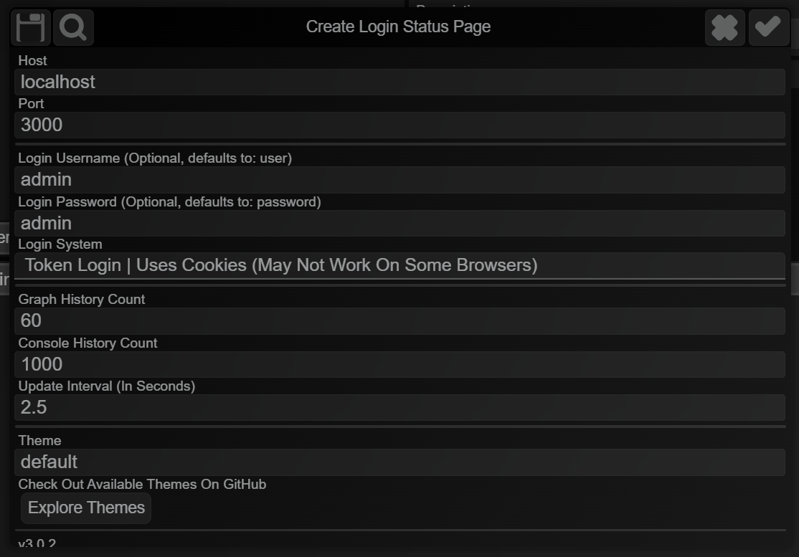

# Status Page

## Documentation

### Host

The `ip` address to host the site on. By default, it is pre-configured to `localhost` (local machine availability). 
If left empty, defaults to `localhost`. 
To host it such that it is available on your local network, host it on `0.0.0.0`.

### Port

The `port` number to listen to. By default, it is pre-configured to port `3000`. 
If left empty, defaults to port `3000`.

### Login Username

The username to login with. 
If left empty, defaults to `user`.

### Login Password

The password to access the site with. 
If left empty, defaults to `password`.

### Login System

By default, it is set to `Basic Login`, meaning it uses the browser's native authorization headers which essentially amounts to a small login pop-up.

If `Token Login` is chosen as the login system, it switches over to using `cookies` and a dedicated login page. 
`cookies` are valid for the number of hours you input, by default it is 24 hours.

### Graph History Count

How many data points are there on the CPU/RAM usage graphs.

### Console History Count

How many console logs / errors to keep in the `Logs` pane of the site.

### Update Interval

How often the usage graph updates in seconds. This is independant of console updates.

### Theme

The theme of the status page, alternative themes are available [here](https://github.com/slothyace/bmd-statusPage/tree/main/themes).

### Check For Latest Version Of Files

This is a toggle that checks for the file hashes on startup, if you have customisations on a theme that is not on GitHub, turn this off.

### Update To HTTPS

Turn this on in order to upgrade the connection to a HTTPS connection, you can input the file paths to the cert files.
